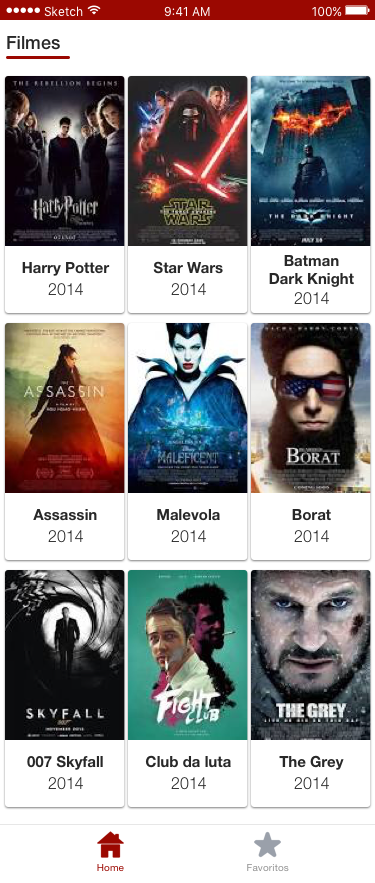
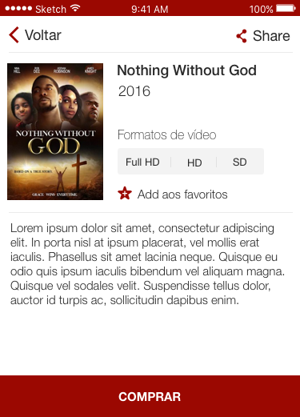

# Teste para avaliação iOS - Kiddo Labs :smirk:

--- 
Este projeto visa testar o conhecimento dos programadores que estão na fase de seleção da [Kiddo Labs](www.kiddolabs.com).

### Linguagens de programação

- Objective-C ou Swift.

### Instruções para a entrega do desafio

1. Primeiro, faça um fork deste projeto para sua conta no GitHub (crie uma se você não possuir).
1. Crie uma nova branch, com seu nome e sobrenome.
1. Faça um pull-request como seu projeto.

### Instruções para o desenvolvimento

- O layout foi desenvolvido em [Sketch](https://www.sketchapp.com/), faça o download trial caso você não possua, ou caso tenha expirado seu período de teste, se baseie nos prints das telas.
- O APP deverá ter 3 telas, e as APIs do [guidebox](https://api.guidebox.com/apidocs#movies)
- A Primeira tela consumirá a API de listar os filmes [API de exemplo](https://api-public.guidebox.com/v1.43/US/rKJwmLEQB3qOouvHckEwjDrsGqKWpHgE/movies/all/1/10/all/all)
- A segunda tela, consumirá a API de detalhe do filme [API de exemplo](https://api-public.guidebox.com/v1.43/US/rKJwmLEQB3qOouvHckEwjDrsGqKWpHgE/movie/138841)
- A terceira tela mostrará as opções de compra do filme, não é necessária a implementação da compra

**Veja a documentação completa das APIs em [API guidebox](https://api.guidebox.com/)** 

### Layouts
Siga o layout abaixo para desenvolver o projeto.

Use o [Teste_iOS.sketch](Teste_iOS.sketch)

|               Home               |            Detalhe do filme           |       Compra do filme
|----------------------------------|---------------------------------------|---------------------------------------|
|  |    |     |           |
                                  

### Tela de principal/tela de favoritos
1. A tela deverá consumir a API de lista de filmes do guidebox, deverá retornar todos os filmes, paginados de 20 em 20 itens.
1. Filtar para mostrar somente os filmes favoritados.
1. Scroll inifinito. 

### Tela de detalhe do filme
1. Pegar as informações do filme usando o ID do mesmo.
1. Usar core-data ou Realm para favoritar o filme.
1. Checar se filme já está salvo, se estiver, trocar botão para remover do favorito.
1. A navegação para tela de compra pode ser personalizada, não precisa ser necessariamente um simples "segue" ou "pushViewController".

### Tela de compra do filme
1. Mostrar todas as opções de compra retornados da API.
1. Caso não tenha nenhuma opção, mostrar que não está disponível para compra ou alugar.

### Deve conter
1. Checar se tem conexão com internet.
1. Caso haja falha na request, avisar a falha.
1. Cache de imagens
1. Scroll infinito.
1. Suportar versão mínima do iOS: 8.*.
1. Usar um arquivo .gitignore no seu repositório.
1. Usar Storyboard e Autolayout (suportar todas as telas de iPhones).
1. Usar gestão de dependências no projeto. Ex: Cocoapods.
1. Usar um Framework para Comunicação com API. Ex: AFNetwork.
1. Fazer mapeamento json -> Objeto.

### Ganha + pontos se contiver :scream:
1. Testes unitários no projeto. Ex: XCTests / Specta + Expecta.
1. Testes funcionais. Ex: KIF.
1. Não conter memory leak (testes via instruments).
1. Pouco uso de memória ram (testes via instruments).
1. Uso otimizado de CPU (testes via instruments).
1. Image com download pregressivo em blur (PINRemoteImage).
1. Documentação do código.
1. Transições personalizadas de tela.
1. Efeitos, muitos efeitos, amamos efeitos. Be creative! :rocket:

As sugestões de bibliotecas fornecidas são só um guideline, sinta-se à vontade para usar soluções diferentes e nos surpreender. O importante de fato é que os objetivos macro sejam atingidos.

### Avaliação :mag_right:

Seu projeto será avaliado de acordo com os seguintes critérios:

1. Sua aplicação preenche os requerimentos básicos?
1. Você documentou a maneira de configurar o ambiente e rodar sua aplicação?
1. Você seguiu as instruções de envio do desafio?
1. Adicionalmente, tentaremos verificar a sua familiarização com as bibliotecas padrões (standard libs), bem como sua experiência com programação orientada a objetos a partir da estrutura de seu projeto.

